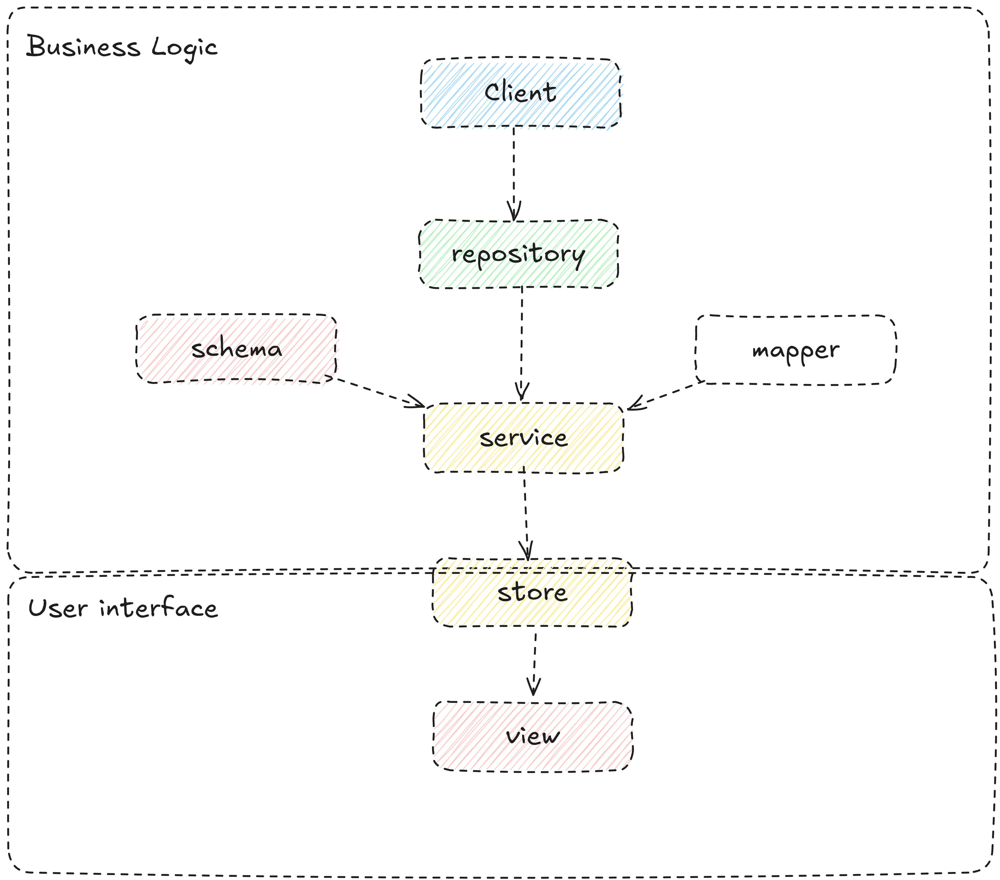

# Getting Started

## Introduction
Welcome to the Vue Boilerplate Project! This project provides a comprehensive and well-structured starting point for developing Vue.js applications. It includes a robust directory structure, essential configurations, and a selection of commonly used utilities and components. Whether you are a beginner looking to learn Vue or an experienced developer seeking a solid foundation for your next project, this boilerplate is designed to save you time and help you adhere to best practices.

This boilerplate has been tested and used in enterprise-level applications, ensuring its reliability and effectiveness. It includes a range of features to help you get started quickly, including state management, routing, and a clean organization of files and directories.

Dive in, and let's build something amazing together!

## Rules
The structure is based on file types on the first look (or level) and separated by domain(or sub-domain) in the second level.

In this structure, we follow three rules:

1. *File and folder naming:* we use kebab-case naming convention. Add the corresponding file extension at the end of the files.

2.  Compostion  Rule: In software engineering composition is the relation between parent and child when a child can't exist without the parent's existence. for example relation between a body part and a human.
When you want to put a file somewhere or even make a file for something, first ask yourself can it exist without its corresponding logic, can I use it alone somewhere else?
If the answer is no, you shouldn't make a file for that. For example, vee-validate rules don't have any meaning without the vee-validate plugin, so it is better to put it alongside its plugin. Or if a constant that is the default value of a function can not exist without that function (or component, or view, it can be anything), so just put it there and there is no need to put it in constants.

  

 

3. Layers: In the above picture, you can see the connection between layers. Learn about each one in the descriptions below. 

> [!DANGER]  
> Note that this picture is about one domain. The connection between layers of one domain is like the picture, but if you want to have a connection between two parts that are not adjacent then you will use `eventBus` for this purpose. But if you want a connection between two domains you may use bridges.
